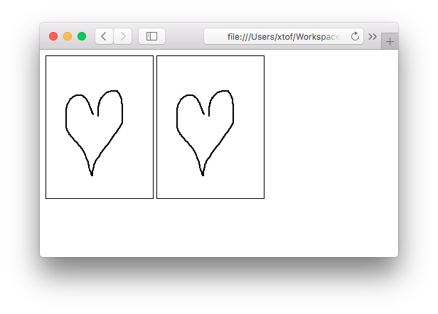

# Canvas Writer
Small HTML5 Canvas library for hand-written fonts and exchange of messages  
author: Christophe VG <contact@christophe.vg>

# Introduction

Using CanvasWriter you can record and replay things you draw on an HTML5 Canvas element. It's completely self-contained and doesn't use any external libraries.

# Record & Play

In its most basic form, that's what it does. Open `examples/record-play.html` in a browser (only Safari is tested right now) and draw something inside the left rectangle on the screen. CanvasWriter will record it and display it when you release your mouse or finger.

