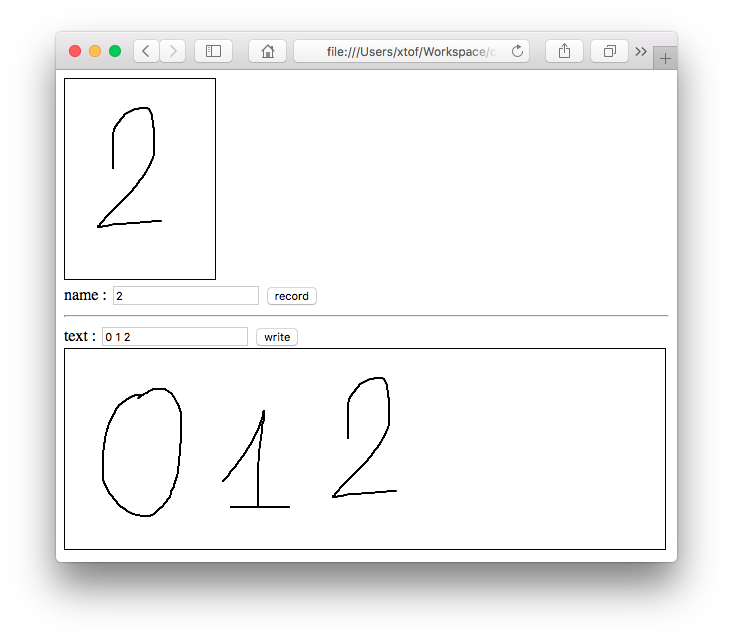

# Canvas Writer
Small HTML5 Canvas library for hand-written fonts and exchange of messages  
author: Christophe VG <contact@christophe.vg>

## Introduction

Using CanvasWriter you can record and replay things you draw on an HTML5 Canvas element. It's completely self-contained and doesn't use any external libraries.

> The docs/ folder is published  [https://christophevg.github.io/canvas-writer](https://christophevg.github.io/canvas-writer)

## Record & Play

In its most basic form, that's what it does. Open `examples/record-play.html` in a browser (only Safari is tested right now), push the `record` button and draw something inside the left rectangle on the screen. When done, push the `stop` button and watch CanvasWriter _write_. In the Javascript console, the recorded data is logged.

## Font

The second example shows how to record multiple drawings/characters and write a series of them as consecutive characters. Open `examples/font.html` in a browser and record multiple drawings, changing the name. Then write a _text_ separating the different names of the characters with a space and press `write`:

